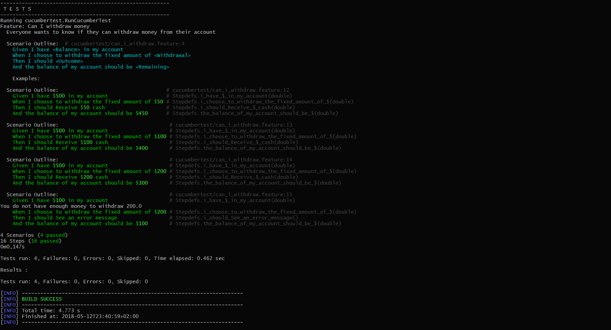

# BDD with Cucumber Exploratory Test Profiling - JMeter

## Cucumber
By using Cucumber, I have learned the meaning with BDD (Behavior Driven Development). BDD is in what is called "Example-driven-development. 

When using BDD, you are following a software development process that emerged from TTD (Test Driven Development). The process is a way that forces you to think about design. Also with BDD you are forced to writing acceptance test. The intent with BDD is for you to find out what your customer or business wants from the software before you start working on it.
This is done by collaborating with them.

When using Cucumber you are using Gherkin to write user stories. Gherkin is a standard way of defining features/user stories and it is a Domain Specific Language. Here you use **Given**, **When** and **Then** in different scenarios. A feature written in Gherkin could look like this:
```Gherkin
Feature: Is it Friday yet?
  Everybody wants to know when it's Friday

  Scenario: Sunday isn't Friday
    Given today is Sunday
    When I ask whether it's Friday yet
    Then I should be told "Nope"
```
Here we could use cucumber to generate some code snippets from this Gherkin code which is very smart. 

We could have used BDD and Cucumber in our project to get better documentation and gotten better knwoledge about our tasks before we started on coding. But if we had to use BDD then I think we should have more time with the teaches so we could talk about features/user stories.

### Test Results
Here is a screenshot of my test results with Cucumber:



## Pairwise
Is a tool that can help with testing all possible combinations. Let's say that we have red, green and blue. There is 3^3 ways of combinating theese. Pairwise can help you with automaticly doing this.

I have made a Pairwise.xlsx in the root of the project.

## Profiling
With software profiling you can invsetigate a program's behavior using information gathered as the program executes. Here we can find out whcih part of the program that needs to be optimized meaning that you can find which parts of the program where to contribute the most due to performance problems and shows you where to concentrate your efforts. 

I have installed Jmeter but I didn't manage to get it to work with my Cucumber project. 

Using profiling in our project could be very usefull, because we are doing alot of SQL quries, and it would have been nice to see where we could optimize our code. 